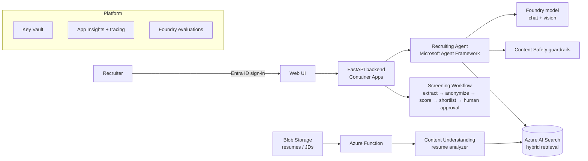

# AI Recruiting Copilot

An Azure AI system that helps recruiters screen candidates **fairly and quickly**. It reads resumes in any format, matches them to job descriptions with a bias-aware screening workflow, and answers questions such as *"Who are the top 5 candidates for the Senior Data Engineer role, and why?"*

> Built as a portfolio project by a technical recruiter moving into AI engineering. It combines 5+ years of recruiting know-how with Microsoft Foundry, Content Understanding, Agent Framework and Azure AI Search.

## Architecture



**Security by default:** every service has API keys disabled. Access uses Microsoft Entra ID and managed identities with least-privilege RBAC.

## Roadmap

| Week | Milestone | Status |
|---|---|---|
| 1 | Infrastructure (Terraform) + synthetic dataset | ✅ |
| 2 | Ingestion: Content Understanding resume extraction + evaluation | ✅ |
| 3 | Recruiting agent with tools (Agent Framework) | ⏳ |
| 4 | Screening workflow + vision input | ⏳ |
| 5 | Guardrails, blind screening, security hardening | ⏳ |
| 6 | Monitoring, evaluations in CI, deployment, demo | ⏳ |

## Repository layout

```
infra/        Terraform: Foundry account + project, models, AI Search, Storage, Key Vault, App Insights, budget, RBAC
scripts/      Synthetic data generator, upload script, .env writer
data/         Generated dataset (git-ignored; regenerate any time)
analyzers/    Content Understanding analyzer definitions (JSON)
src/copilot/  Application code: Content Understanding client, profile normalization, evaluation
tests/        Offline unit tests (pytest)
docs/         Design notes and decisions
```

---

## Week 1 setup

### Prerequisites
- An Azure subscription with permission to create resources and role assignments (Owner, or Contributor + User Access Administrator)
- [Azure CLI](https://learn.microsoft.com/cli/azure/install-azure-cli), [Terraform](https://developer.hashicorp.com/terraform/install) 1.6+, Python 3.11+

On a Mac: `brew install azure-cli terraform python@3.12`

### 1. Sign in
```bash
az login
az account show --query "{name:name, id:id}" -o table
```

### 2. Deploy the infrastructure
```bash
cd infra
cp terraform.tfvars.example terraform.tfvars   # add your subscription ID + email
terraform init
terraform plan -out tfplan
terraform apply tfplan
cd ..
./scripts/write_env.sh                          # creates .env from Terraform outputs
```

### 3. Generate and upload the synthetic dataset
```bash
python3 -m venv .venv && source .venv/bin/activate
pip install -r requirements.txt
python scripts/generate_synthetic_data.py      # 40 resumes (PDF/DOCX/scanned PNG) + 5 JDs + ground truth
python scripts/upload_data.py
```

### 4. Check it worked
- In the Azure portal, open **rg-recruitcopilot**. You should see about 9 resources.
- In the storage account, the **resumes** and **job-descriptions** containers should contain the files.
- In [Foundry](https://ai.azure.com), open the project **proj-recruiting** and confirm both model deployments are there.

### Tearing it down (to save money)
```bash
cd infra && terraform destroy
```
Run `terraform apply` again whenever you need it. Regenerate the dataset with the same seed and it comes out identical.

### Troubleshooting
| Error | Fix |
|---|---|
| AI Search: only one free service per subscription | Delete the old free search service, or set `search_sku = "basic"` (paid) |
| Model / version not available, or `InsufficientQuota` | Pick a model listed in your region's Foundry catalog and set `chat_model_name` / `chat_model_version`, or lower `chat_capacity` |
| `AuthorizationFailed` right after apply | RBAC can take a few minutes to take effect. Wait, then try again |
| Key Vault name already exists | A soft-deleted vault is using the name: `az keyvault purge --name <name>` |

## Week 2: resume extraction with Content Understanding

A custom analyzer ([`analyzers/resume-analyzer.json`](analyzers/resume-analyzer.json)) turns each resume (PDF, Word or scanned image) into a structured profile: name, contact details, skills, certifications, work history, total years of experience, education, a **classified** role family, and flags for protected information (date of birth, marital status, photo) so the screening step can remove them later.

```bash
source .venv/bin/activate
pip install -r requirements.txt
pytest -q                                         # offline tests, no Azure calls
python scripts/setup_content_understanding.py     # one-time: model defaults + create analyzer
python scripts/extract_resumes.py --limit 3       # quick test
python scripts/extract_resumes.py                 # all 40 resumes -> data/extracted/
python scripts/evaluate_extraction.py             # score vs ground truth -> docs/eval/extraction_report.md
```

Results: see [docs/eval/extraction_report.md](docs/eval/extraction_report.md).

## The dataset

`scripts/generate_synthetic_data.py` creates **fake** candidates. No real person's data is ever used.

- 40 resumes across 6 role families, 1–15 years of experience, in a mix of PDF, Word and scanned-image formats.
- Some resumes include information a recruiter should *not* screen on, such as date of birth, marital status or a photo. These are there on purpose to test the blind-screening step.
- `ground_truth.json` holds the expected extraction for every resume and a transparent baseline ranking per job. It's used to evaluate the extraction and the agent in later weeks.

## Cost

With AI Search on the Free tier and pay-per-use models, Week 1 costs close to nothing while idle. A budget alert emails you at 50%, 80% and a forecast 100% of the monthly limit (default 20).
